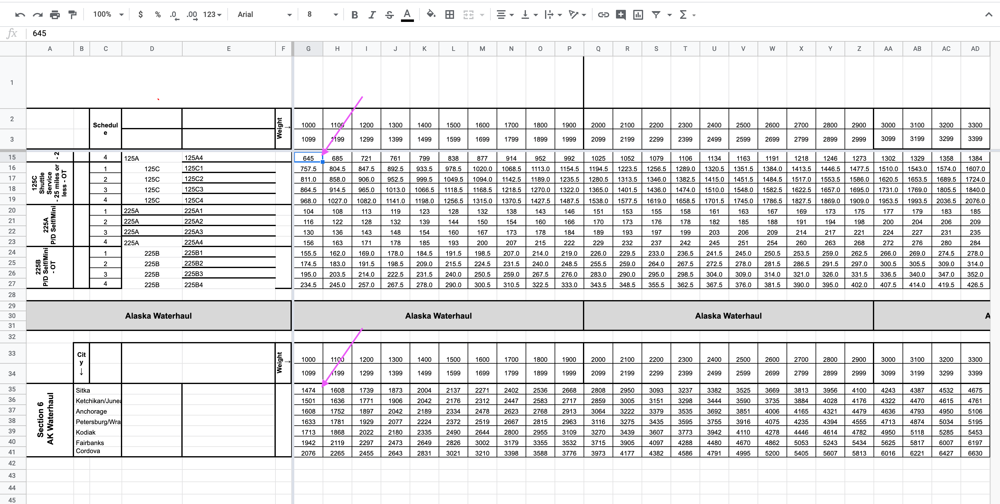
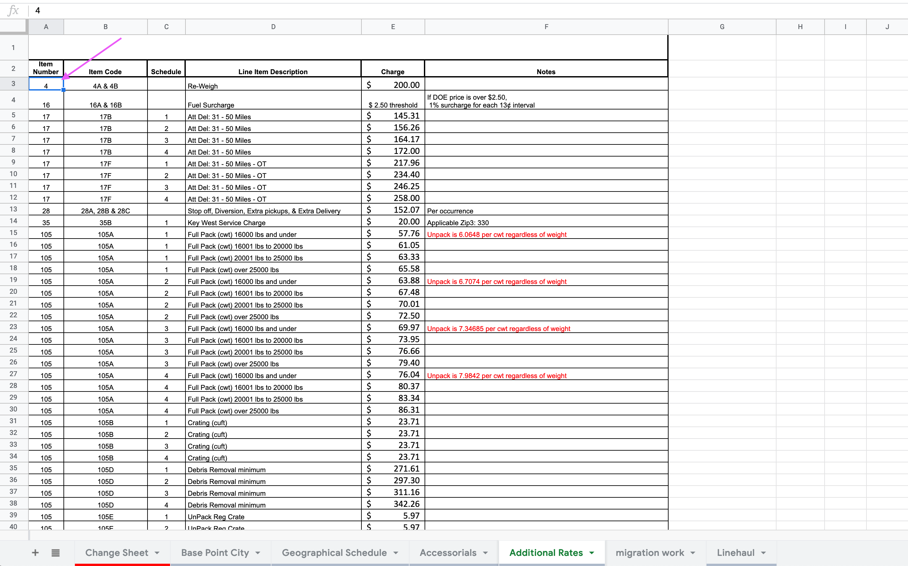

# Importing tariff400ng data for the year

## Tables that need to be updated with the new data

1. `tariff400ng_full_pack_rates`
2. `tariff400ng_full_unpack_rates`
3. `tariff400ng_linehaul_rates`
4. `tariff400ng_service_areas`
5. `tariff400ng_shorthaul_rates`
6. `tariff400ng_item_rates`

## Obtain yearly rates `xlsx` file from ustranscom

1. Visit: [https://www.ustranscom.mil/dp3/hhg.cfm](https://www.ustranscom.mil/dp3/hhg.cfm) (for some reason, I had to load hit this url twice... the first visit redirected to another page).
2. Look under “Special Requirements and Rates Team” -> “Domestic” -> “400NG Baseline Rates” and download yearly rate file.
3. Copy the file to DP3 Google drive: DP3 -> Engineering -> Reference Docs -> rate engine: filing

## Importing `full_pack_rates`, `full_unpack_rates`, `linehaul_rates`, `service_areas`, and `shorthaul_rates`

### Extract data from `xlsx` file via `Ruby` scripts

1. Clone the Truss fork of the [move.mil repository](https://github.com/trussworks/move.mil)
2. Run `bin/setup` on the command line and make sure there were no errors in populating the seed data.
3. Add the new `xlsx` file to the `lib/data` directory in the following format: `{YEAR} 400NG Baseline Rate.xlsx`.
4. Open `db/seeds.rb`
5. Near the bottom of the file, you'll see some commented code that imports baseline rates for previous years. Add the following and change the date range as needed:

    ```ruby
    puts '-- Seeding 2019 400NG baseline rates...'
    Seeds::BaselineRates.new(
      date_range: Range.new(Date.parse('2019-05-15'), Date.parse('2020-05-14')),
      file_path: Rails.root.join('lib', 'data', '2019 400NG Baseline Rates.xlsx')
    ).seed!
    ```

6. Run `rails db:reset` to drop the database, re-run migrations, and re-run the seeds import.
7. Dump the tables: `pg_dump --inserts -t full_packs -t full_unpacks -t linehauls -t service_areas -t shorthauls move_mil_development`

### Load dumped tables into database via migrations

#### Related prs

* [2018 data load](https://github.com/transcom/mymove/pull/338)
* [2019 data load](https://github.com/transcom/mymove/pull/2036)

1. Create migration to load dump tables into `temp tables`. (see pr for example).
2. Create migration to transform `temp table` data into `MilMove` table structures. (see pr for example).

## Add additional `sit` data to `tariff400ng_service_areas` table

### The extracted data from the ruby scripts doesn't contain all the data we need. We also need `185A SIT First Day & Whouse`, `185B SIT Addl Days`, and `SIT PD Schedule` found on the `Geographical Schedule` sheet

#### Related prs

* [2018 data load](https://github.com/transcom/mymove/pull/382)
* [2019 data load](https://github.com/transcom/mymove/pull/2036)

1. Create a function that will take values and update the corrisponding columns in the `tariff400ng_service_areas`. (see pr for details)
2. Transform rates into cents add for each row, transform row into form `SELECT update_sit_rates('service_area', sit_185a, sit_185b, sit_pd_schedule);` for each row.
3. Remember to drop the function in the migration.

## Importing `item_rates`

### Transform data from `xlsx` file

We're going to make use of the work that Patrick Stanger delivered in [this PR](https://github.com/transcom/mymove/pull/1286).

1. Open [this google sheet](https://docs.google.com/spreadsheets/d/1z1O6hvditeVE4AX1UI-XGu0puwIidXA08tVT6VkG254/edit#gid=138983343) alongside the 400ng data you have received for the upcoming year.
2. Visit the `Accessorials` tab in both spreadsheets.
3. In the new data sheet, within the main section and the Alaska waterhaul section, copy all the values to the left of where it says "weight". Start with the cells marked in the screenshot below:
    
4. Paste those values into the corresponding `Accessorials` tab in the other sheet.
5. Repeat this same process for the `Additonal Rates` tab. Starting at the cell marked in the screenshot below:
    
6. Head over to the `migration work` tab. Here, you'll find that queries have been generated for you to insert records into the milmove database.
7. Copy all of the values in the `query` column for both the `Additional Rates` table at the top of the sheet and the `Accessorials` table below it.
8. Replace

### Load item rates into database

#### Related prs

* [2018 data load](https://github.com/transcom/mymove/pull/1286)
* [2019 data load](https://github.com/transcom/mymove/pull/2036)

1. Create migration to load `insert` statements generated from the sheet above.
2. Replace `ID_HERE` with `uuid_generate_v4()` to generate a uuid.

### Fix certain item rates. Update `weight_lbs_lower` and update `rate_cents` for specific codes

#### Related prs

* [2018 data load](https://github.com/transcom/mymove/pull/1313)
* [2019 data load](https://github.com/transcom/mymove/pull/2060)

1. Create migration to modify `weight_lbs_lower` and `rate_cents` (see pr for example).
  Note - This step could be addressed when origionally tranforming the data in the `xlsx`.

## Spot check for correct data

Ensure the data loaded looks correct by checking a count of row numbers grouped by date.

1. ```select effective_date_lower, effective_date_upper, count(*) from tariff400ng_full_pack_rates group by effective_date_lower, effective_date_upper order by effective_date_lower DESC;```

2. ```select effective_date_lower, effective_date_upper, count(*) from tariff400ng_full_unpack_rates group by effective_date_lower, effective_date_upper order by effective_date_lower DESC;```

3. ```select effective_date_lower, effective_date_upper, count(*) from tariff400ng_item_rates group by effective_date_lower, effective_date_upper order by effective_date_lower DESC;```

4. ```select effective_date_lower, effective_date_upper, count(*) from tariff400ng_linehaul_rates group by effective_date_lower, effective_date_upper order by effective_date_lower DESC;```

5. ```select effective_date_lower, effective_date_upper, count(*) from tariff400ng_service_areas group by effective_date_lower, effective_date_upper order by effective_date_lower DESC;```

6. ```select effective_date_lower, effective_date_upper, count(*) from tariff400ng_shorthaul_rates group by effective_date_lower, effective_date_upper order by effective_date_lower DESC;```

## Test

1. Deploy branch in `experimental`.
2. Create a move for a date that is between the `effective_date_lower` and `effective_date_upper`.
3. Watch the console and ensure the app doesn't throw any errors.
