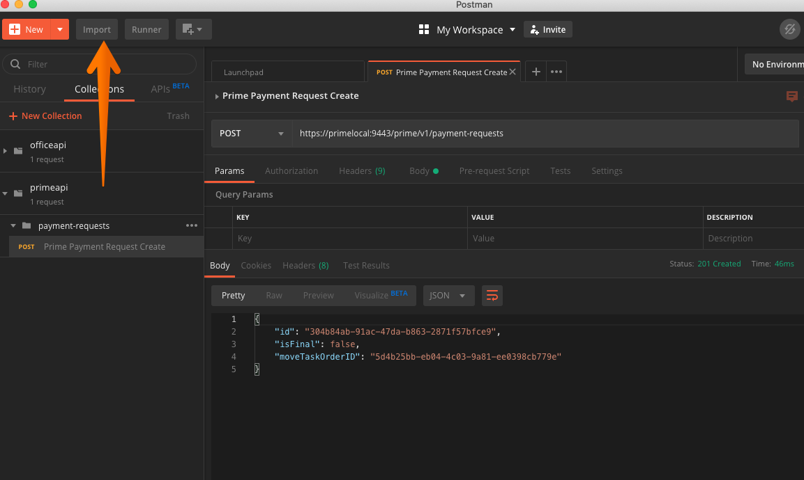
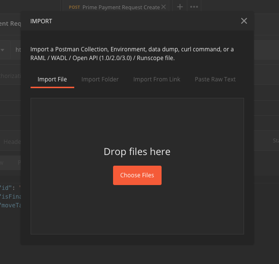
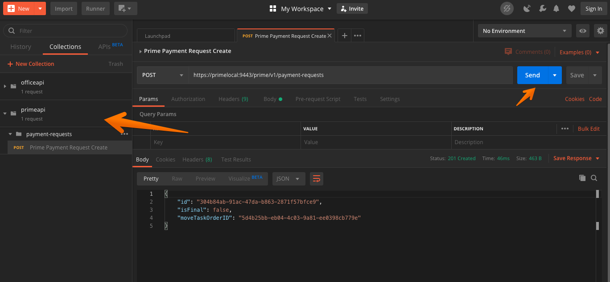

# How to Make a Sample Prime API Call

To interact and use the prime api you will need a client that can send the appropriate mutual TLS certificate. This document shows you how to call the prime api client with `curl` or [Postman](https://www.getpostman.com/)

* [Prerequisites](#prerequisites)
  * [General Postman settings](#general-postman-settings)
  * [Postman Environment settings](#postman-environment-settings)
* [Payment Request API](#payment-request-api)
  * [Create a Payment Request](#create-a-payment-request)
    * [Prime API helper script](#prime-api-helper-script)
    * [Postman](#postman)

## Prerequisites

It is expected that you have the server running using `make server_run` before any of the following directions will work.

### Hostname setup

You will need `primelocal` setup as a host in your `/etc/hosts` file. To check run `check-hosts-file` to verify if you have this set or not. If it is missing follow the directions specified by `check-hosts-file` to complete the setup.

### E2E Data

The examples below rely on the E2E test data, for these examples to work you will need to ensure that data is populated in the database.

To do so run `make db_dev_e2e_populate`

### General Postman settings

If you are planning to use [Postman](https://www.getpostman.com/) you will need to follow the setup directions in [How to setup Postman for Mutual TLS API calls](setup-postman-to-make-mutual-tls-api-calls.md).


## Payment Request API

### Create a Payment Request

#### Prime API helper script

Sample create payment request call using `scripts/prime-api` to hit the api endpoint. First save the following json to a file called `data.json`.

```json
{
  "isFinal": false,
  "moveTaskOrderID": "5d4b25bb-eb04-4c03-9a81-ee0398cb779e",
  "serviceItems": [
    {
      "id": "9db1bf43-0964-44ff-8384-3297951f6781",
      "params": [
        {
          "key": "weight",
          "value": "1234"
        },
        {
          "key": "pickup",
          "value": "2019-12-16"
        }
      ]
    },
    {
      "id": "d886431c-c357-46b7-a084-a0c85dd496d3",
      "params": [
        {
          "key": "weight",
          "value": "5678"
        }
      ]
    }
  ]
}
```

Once the file is created you can run the following command to hit the api

```sh
prime-api payment-requests POST data.json
```

Sample successful response

```json
{
  "id": "e415eafa-33cc-40e6-a91f-41d96161967d",
  "isFinal": false,
  "moveTaskOrderID": "5d4b25bb-eb04-4c03-9a81-ee0398cb779e"
}
```

#### Postman

Be sure you have followed the steps described in _General Settings_ above, before following the steps described here.

Open the Import dialog



Use the Import dialog to import the `swagger/prime.yaml` file



You should now have a `move.mil API` collection which will contain sample requests for all endpoints defined by the api swagger file. Select the `Creates a payment request`, modify the sample request as below, and click **Send**. The image below also includes the sample successful response.

```json
{
  "isFinal": false,
  "moveTaskOrderID": "5d4b25bb-eb04-4c03-9a81-ee0398cb779e",
  "serviceItems": [
    {
      "id": "9db1bf43-0964-44ff-8384-3297951f6781",
      "params": [
        {
          "key": "weight",
          "value": "1234"
        },
        {
          "key": "pickup",
          "value": "2019-12-16"
        }
      ]
    },
    {
      "id": "d886431c-c357-46b7-a084-a0c85dd496d3",
      "params": [
        {
          "key": "weight",
          "value": "5678"
        }
      ]
    }
  ]
}
```



