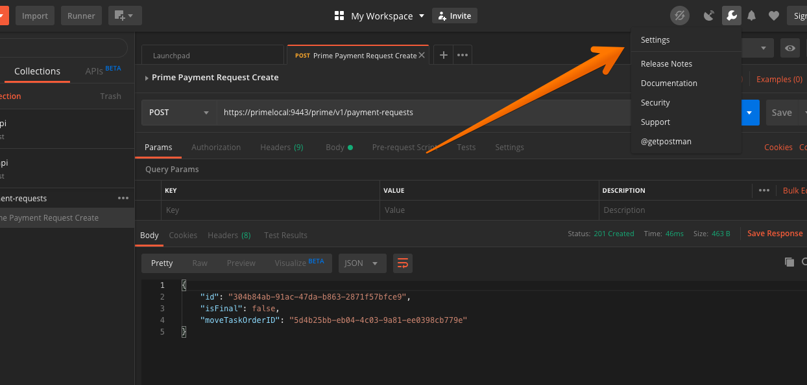
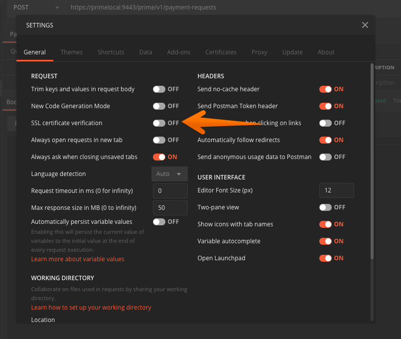
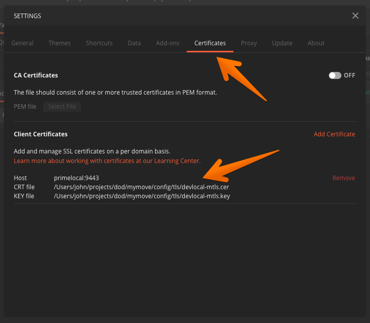

# How to Make a Sample Prime API Call

To interact and use the prime api you will need a client that can send the appropriate mutual TLS certificate. This document shows you how to call the prime api client with `curl` or [Postman](https://www.getpostman.com/)

* [Prerequisites](#prerequisites)
  * [General Postman settings](#general-postman-settings)
* [Payment Request API](#payment-request-api)
  * [Create a Payment Request](#create-a-payment-request)
    * [Curl](#curl)
    * [Postman](#postman)

## Prerequisites

It is expected that you have the server running using `make server_run` before any of the following directions will work.

### General Postman settings

If you are planning to use [Postman](https://www.getpostman.com/) you will need to make the following changes that apply to all prime api requests.

Open the general settings panel by clicking the wrench icon in the upper left corner



Under the _General_ tab turn off **SSL certificate verification**



Switch to the **Certificates** tab and add the development certificate with the following settings:

* **Host** `primelocal`
* **Port** `9443`
* **CRT File** `config/tls/devlocal-mtls.cer`
* **KEY File** `config/tls/devlocal-mtls.key`



## Payment Request API

### Create a Payment Request

#### Curl

Sample create payment request call

```sh
curl -X POST \
  --insecure \
  --cert ./config/tls/devlocal-mtls.cer  \
  --key ./config/tls/devlocal-mtls.key \
  https://primelocal:9443/prime/v1/payment-requests \
  --header 'Content-Type: application/json' \
  --data '{
      "isFinal": false,
      "moveTaskOrderID": "5d4b25bb-eb04-4c03-9a81-ee0398cb779e",
      "serviceItems": [
        {
          "id": "94a63112-922e-4038-96c6-8e6736fb1ed9",
          "params": [
            {
              "key": "Service Item Parameter Name",
              "value": "Service Item Parameter Value"
            }
          ]
        }
      ]
    }'
```

Sample successful response

```json
{
  "id": "e415eafa-33cc-40e6-a91f-41d96161967d",
  "isFinal": false,
  "moveTaskOrderID": "5d4b25bb-eb04-4c03-9a81-ee0398cb779e"
}
```

#### Postman

Be sure you have followed the steps described in _General Settings_ above, before following the steps described here.

Open the Import dialog


Use the Import dialog to import the `docs/postman/primeapi.postman_collection.json` file


You should now have a `primeapi` collection which will contain a sample create prime payment request that could be sent.  Select the `Prime Payment Request Create` and click **Send**. The image below also includes the sample successful response.


