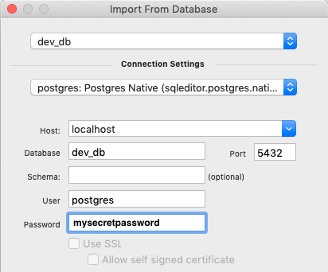

# Schema Documentation

This documentation was created using [SQLEditor](https://www.malcolmhardie.com/sqleditor/)

## Installing the tool

You can either download the installer directly from the [website](https://www.malcolmhardie.com/sqleditor/)
 or install SQLEditor via brew

```console
my_machine ~:$ brew cask install sqleditor
```

If you use SQLEditor frequently, you will need to purchase a license for the tool.

## Loading the sql diagram

Loading is accomplished in a few steps:

1. Reset the DB on your branch or master with `make db_dev_reset && make db_dev_migrate`
2. Open SQLEditor and go to (File -> Import From Database).  Entering the `dev_db` connection information. 
3. After the data has been imported save the file as [dp3.sqs](https://github.com/transcom/mymove/blob/master/docs/schema/dp3.sqs) so you can refer to it.
